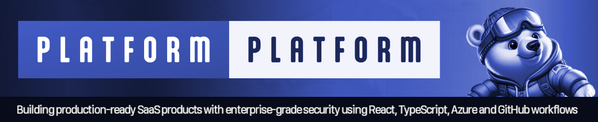

# 👋 Welcome to TypeScript Platform

Kick-start building top-tier B2B & B2C cloud SaaS products with sleek design, fully localized and accessible, clean architecture, automated and fast DevOps, and top-notch security. All in one place – at zero cost.

This is in the box:

* **Backend** - Elysia and TypeScript adhering to the principles of Clean Architecture, DDD, CQRS, and clean code
* **Frontend** - React using TypeScript, with a sleek fully localized UI and a mature accessible design system
* **CI/CD** - GitHub actions for fast passwordless deployments of application (Docker) and infrastructure (Bicep)
* **Infrastructure** - Cost efficient and scalable Azure PaaS services like Azure Container Apps, Azure SQL, etc.
* **Developer CLI** - Extendable TypeScript CLI for DevEx - set up CI/CD is one command and a couple of questions

Still pre-alpha state, follow our [up-to-date roadmap](https://github.com/orgs/TypeScriptPlatform/projects/2/views/2) with core SaaS features like multi-tenancy, authentication, SSO, user management, telemetry, monitoring, alerts, multi-region, feature flags, back office for support, etc.

Show your support for our project – Give us a star on GitHub! It truly means a lot! ⭐

This project is a fork of the [PlatformPlatform](https://github.com/platformplatform/PlatformPlatform) project - An enterprise grade solution for .Net developers.

# Getting Started 1-2-3

1. **Fork and clone the repository**
2. **Run `tilt up`**

### Prerequisites

For development, you need Tilt, Docker, and Bun. And GitHub and Azure CLI for setting up CI/CD.

## 1. Fork and clone the repository

Forking is only required to configure GitHub repository with continuous deployments to Azure ([step 3](#4-set-up-cicd-with-passwordless-deployments-from-github-to-azure)).

Our clean commit history serves as a great learning and troubleshooting resource. We recommend you keep it 😃

## 2. Run Tilt to spin up everything on localhost

Using docker images with SQL Server, Blob Storage, and mail server will be downloaded and started. No need install anything, or learn complicated commands. Simply run this command, and everything just works 🎉

```bash
tilt up # First run will be slow as Docker images are downloaded
```

## 3. Set up CI/CD with passwordless deployments from GitHub to Azure

Run this command to automate Azure Subscription configuration and set up [GitHub Workflows](https://github.com/tinytek-io/PlatformPlatform/actions) for deploying [Azure Infrastructure](/cloud-infrastructure/) (using Bicep) and compiling [application code](/application/) to Docker images deployed to Azure Container Apps:

```bash
npx developer-cli configure-continuous-deployments # Tip: Add --verbose-logging to show the used CLI commands
```

You need to be the owner of the GitHub repository and the Azure Subscription, plus have permissions to create Service Principals and Active Directory Groups.

The command will first prompt you to login to Azure and GitHub, and collect information. You will be presented with a complete list of changes before they are applied. It will look something like this:


Except for adding a DNS record, everything is fully automated. After successful setup, the command will provide simple instructions on how to configure branch policies, Sonar Cloud static code analysis, and more.

The infrastructure is configured with auto-scaling and hosting costs in focus. It will cost less than 2 USD per day for a cluster, and it will allow scaling to millions of users 🎉

# Inside Our Monorepo

TypeScriptPlatform is a [monorepo](https://en.wikipedia.org/wiki/Monorepo) containing all application code, infrastructure, tools, libraries, documentation, etc. A monorepo is a powerful way to organize a codebase, used by Google, Facebook, Uber, Microsoft, etc.

```bash
.
├─ .github               # Separate GitHub workflows for deploying Infrastructure and app
├─ application           # Contains the application source code
│  ├─ AppGateway         # Main entry point for the app using YARP as a reverse proxy 
│  ├─ account-management # Self-contained system with account sign-up, user management, etc.
│  │   ├─ WebApp         # React SPA frontend using TypeScript and React Aria Components
│  │   ├─ Api            # Presentation layer exposing the API to WebApp or other clients
│  │   ├─ Application    # Use Case layer containing CQRS Command and Query handlers 
│  │   ├─ Domain         # Business logic containing DDD aggregates, entities, etc.
│  │   ├─ Infrastructure # Integrations for accessing external resources (e.g., database)
│  │   ├─ Workers        # Background workers for long-running tasks and event processing
│  │   └─ Tests          # Tests for the API, Application, Domain, and Infrastructure
│  ├─ shared-kernel      # Reusable components for all self-contained systems (Back-end)
│  ├─ shared-webapp      # Reusable components for all self-contained systems (Front-end)
│  ├─ [saas-scs]         # [Your SCS] Create your SaaS product as a self-contained system
│  └─ back-office        # A self-contained system for operations and support (empty for now)
├─ cloud-infrastructure  # Contains Bash and Bicep scripts (IaC) for Azure resources
│  ├─ cluster            # Scale units like production-west-eu, production-east-us, etc.
│  ├─ environment        # Shared resources like App Insights for all Production clusters
│  ├─ shared             # Azure Container Registry shared between all environments
│  └─ modules            # Reusable Bicep modules like Container App, SQL Server, etc.
└─ development-cli       # A TypeScript CLI tool for automating common developer tasks
```

** A [Self-Contained System](https://scs-architecture.org/) is a large microservice (or a small monolith) that contains the full stack, including frontend, background jobs, etc. These can be developed, tested, deployed, and scaled in isolation.

# Technologies

### Elysia Backend With Clean Architecture, DDD, CQRS and TypeScript

The backend is built using the most popular, mature, and commonly used technologies in the TypeScript ecosystem:

- [Bun](https://bun.sh)
- [TypeScript](https://www.typescriptlang.org)
- [Prisma](https://www.prisma.io)
- [Helmet](https://helmetjs.github.io)
- [Swagger](https://swagger.io)
- [Row-Level Security](https://www.postgresql.org/docs/14/ddl-rowsecurity.html)
- [SonarCloud](https://sonarcloud.io)
- [Zod](https://zod.dev)
- [Lucia](https://lucia-auth.com)

<details>

<summary>Read more about the backend architecture</summary>

- **Clean Architecture**: The codebase is organized into layers that promote separation of concerns and maintainability.
- **Domain-Driven Design (DDD)**: DDD principles are applied to ensure a clear and expressive domain model.
- **Command Query Responsibility Segregation (CQRS)**: This clearly separates read (query) and write (command) operations, adhering to the single responsibility principle (each action is in a separate command).
- **Screaming architecture**: The architecture is designed with namespaces (folders) per feature, making the concepts easily visible and expressive, rather than organizing the code by types like models and repositories.
- **MediatR pipelines**: MediatR pipeline behaviors are used to ensure consistent handling of cross-cutting concerns like validation, unit of work, and handling of domain events.
- **Strongly Typed IDs**: The codebase uses strongly typed IDs, which are a combination of the entity type and the entity ID. This is even at the outer API layer, and Swagger translates this to the underlying contract. This ensures type safety and consistency across the codebase.
- **JetBrains Code style and Cleanup**: JetBrains Rider/ReSharper is used for code style and automatic cleanup (configured in `.DotSettings`), ensuring consistent code formatting. No need to discuss tabs vs. spaces anymore; Invalid formatting breaks the build.
- **Monolith prepared for self-contained systems**: The codebase is organized into a monolith, but the architecture is prepared for splitting in to self-contained systems. A self-contained system is a large microservice (or a small monolith) that contains the full stack including frontend, background jobs, etc. These can be developed, tested, deployed, and scaled in isolation, making it a good compromise between a large monolith and many small microservices. Unlike the popular backend-for-frontend (BFF) style with one shared frontend, this allows teams to work fully independently.
- **Shared Kernel**: The codebase uses a shared kernel for all the boilerplate code required to build a clean codebase. The shared kernel ensures consistency between self-contained systems, e.g., enforcing tenant isolation, auditing, tracking, implementation of tactical DDD patterns like aggregate, entities, repository base, ID generation, etc.

Although some features like authentication and multi-tenancy are not yet implemented, the current implementation serves as a solid foundation for building business logic without unnecessary boilerplate.

</details>

### React Frontend With TypeScript, React Aria Components, and Node

The frontend is built with these technologies:

- [React](https://react.dev)
- [TypeScript](https://www.typescriptlang.org)
- [React Aria Components](https://react-spectrum.adobe.com/react-aria/react-aria-components.html)
- [Tanstack Router](https://tanstack.com)
- [Node](https://nodejs.org/en)

### Azure Cloud Infrastructure With Enterprise-Grade Security and Zero Secrets

TypeScriptPlatform's cloud infrastructure is built using the latest Azure Platform as a Service (PaaS) technologies:

- [Azure Container Apps](https://learn.microsoft.com/en-us/azure/container-apps/overview)
- [Azure SQL](https://azure.microsoft.com/en-us/products/azure-sql)
- [Azure Blob Storage](https://azure.microsoft.com/en-us/services/storage/blobs)
- [Azure Service Bus](https://azure.microsoft.com/en-us/services/service-bus)
- [Azure Key Vault](https://azure.microsoft.com/en-us/services/key-vault)
- [Azure Application Insights](https://azure.microsoft.com/en-us/services/monitor)
- [Azure Log Analytics](https://azure.microsoft.com/en-us/services/monitor)
- [Azure Virtual Network](https://azure.microsoft.com/en-us/services/virtual-network)
- [Azure Managed Identities](https://docs.microsoft.com/en-us/azure/active-directory/lifecyclesmanaged-identities-azure-resources/overview)
- [Azure Container Registry](https://azure.microsoft.com/en-us/products/communication-services/)
- [Azure Communication Services](https://azure.microsoft.com/en-us/products/communication-services/)
- [Microsoft Defender for Cloud](https://azure.microsoft.com/en-us/products/defender-for-cloud)

<details>

<summary>Read more about this enterprise-grade architecture</summary>

- **Platform as a Service (PaaS) technologies**: Azure is the leading Cloud Service Provider (CSP) when it comes to PaaS technologies. TypeScriptPlatform uses PaaS technologies which are fully managed by Microsoft, as opposed to Infrastructure as a Service (IaaS) technologies where the customer is responsible for the underlying infrastructure. This means that Microsoft is responsible for the availability of the infrastructure, and you are only responsible for the application and data. This makes it possible for even a small team to run a highly scalable, stable, and secure solution.
- **Enterprise-grade security with zero secrets**:
  - **Managed Identities**: No secrets are used when Container Apps connect to e.g. Databases, Blob Storage, and Service Bus. The infrastructure uses Managed Identities for all communication with Azure resources, eliminating the need for secrets.
  - **Federated credentials**: Deployment from GitHub to Azure is done using federated credentials, establishing a trust between the GitHub repository and Azure subscription based on the repository's URL, without the need for secrets.
  - **No secrets expires**: Since no secrets are used, there is no need to rotate secrets, and no risk of secrets expiring.
  - **100% Security Score**: The current infrastructure configuration follows best practices, and the current setup code achieves a 100% Security Score in Microsoft Defender for Cloud. This minimizes the attack surface and protects against even sophisticated attacks.
- **Automatic certificate management**: The infrastructure is configured to automatically request and renew SSL certificates, eliminating the need for manual certificate management.
- **Multiple environments**: The setup includes different environments like Development, Staging, and Production, deployed into clearly named resource groups within a single Azure Subscription.
- **Multi-region**: Spinning up a cluster in a new region is a matter of adding one extra deployment job to the GitHub workflow. This allows customers to select a region where their data is close to the user and local data protection laws like GDPR, CCPA, etc. are followed.
- **Azure Container Apps**: The application is hosted using Azure Container Apps, which is a new service from Azure that provides a fully managed Kubernetes environment for running containerized applications. You don't need to be a Kubernetes expert to run your application in a scalable and secure environment.
- **Scaling from zero to millions of users**: The Azure Container App Environment is configured to scale from zero to millions of users, and the infrastructure is configured to scale automatically based on load. This means the starting costs are very low, and the solution can scale to millions of users without any manual intervention. This enables having Development and Staging environments running with very low costs.
- **Azure SQL**: The database is hosted using Azure SQL Database, which is a fully managed SQL Server instance. SQL Server is known for its high performance, stability, scalability, and security. The server will easily handle millions of users with single-digit millisecond response times.

</details>

# Screenshots

This is how it looks when GitHub workflows has deployed Azure Infrastructure:


These are the resource groups created when deploying one staging cluster, and two production clusters:


This is the security score after deploying TypeScriptPlatform resources to Azure. Achieving a 100% security score in Azure Defender for Cloud without exemptions is not trivial.


https://123456789012345678901234.blob.core.windows.net/profileimages/01HS13BVF09A8AYYCMR2T9P7ZN.png
